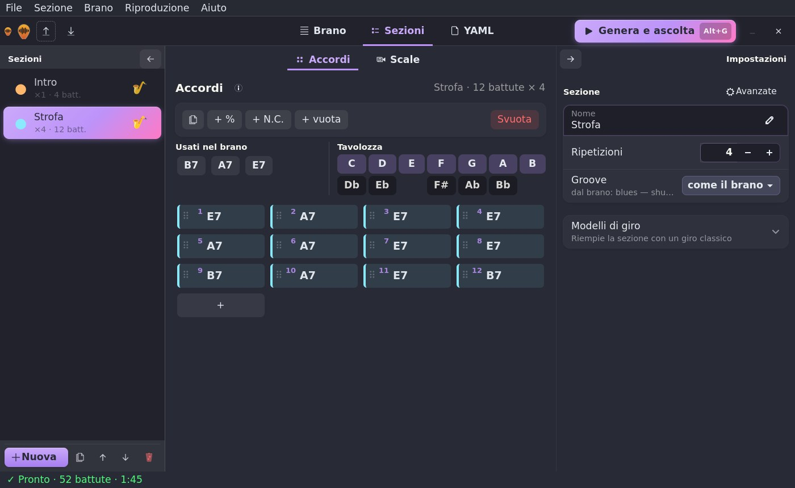
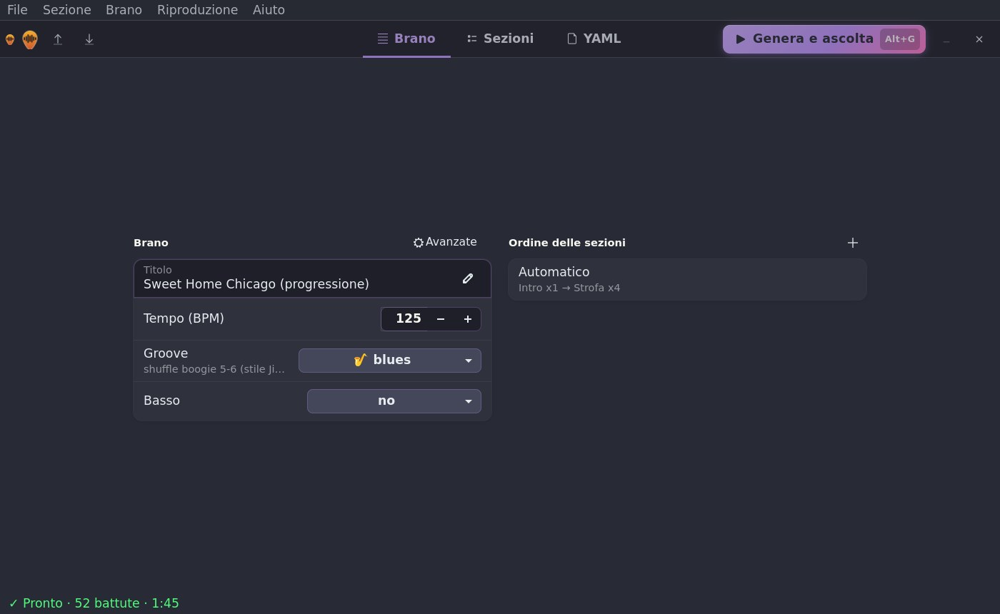
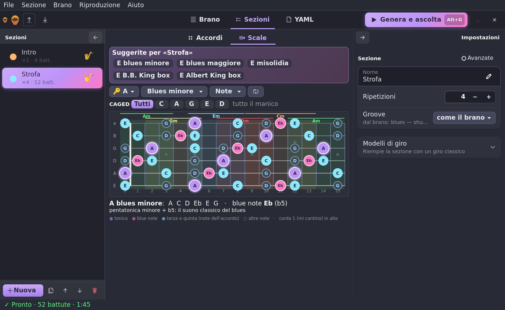
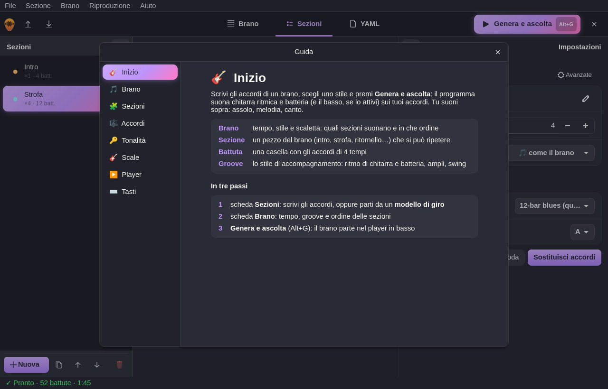

<p align="center">
  
</p>

<p align="center"><a href="README.md">🇬🇧 English</a> · <b>🇮🇹 Italiano</b></p>

<p align="center">
  <b>Scrivi gli accordi, scegli il groove, suona sopra.</b><br>
  Backing track con chitarra ritmica e batteria <i>campionate da strumenti veri</i>, generate da un semplice file YAML
  o da un editor grafico.
</p>

<p align="center">
  
  
  
  
  
  
  
</p>

---

## 📑 Indice

- [✨ Caratteristiche](#-caratteristiche)
- [📦 Installazione](#-installazione)
- [🚀 Avvio rapido](#-avvio-rapido)
- [🖥️ Editor grafico](#️-editor-grafico)
- [📖 Documentazione](#-documentazione)
- [🛠️ Sviluppo](#️-sviluppo)
- [🙏 Crediti e licenze](#-crediti-e-licenze)

---

## ✨ Caratteristiche

- 🎸 **Chitarre vere**: Gretsch hollowbody (default), Epiphone, Fender solid body e chitarra acustica, campionate
  nota per nota con più dinamiche e round robin, più i veri colpi **staccato** per palm mute e chop. Voicing barré,
  aperti, jazz e triadi; pennate giù/su, bicordi boogie, boom-chick. Ogni corda suona una nota alla volta.
- 🔊 **Ampli e casse vere**: 5 suoni (clean, blues, twang, crunch, high gain) su vere casse Marshall 4×12 riprodotte
  con le loro *impulse response*; chitarra **doppiata L/R** nel rock, **slapback** nel rockabilly.
- 🥁 **Batteria acustica campionata** (Salamander Drumkit): hi-hat aperto/chiuso, ghost note, variazioni ogni 4
  battute, **rullate** a fine sezione, piatto sugli attacchi.
- 🎻 **Basso opzionale**: contrabbasso o basso elettrico, con walking, root-fifth, ottavi, reggae, tumbao…
- 🎚️ **125 groove** in 8 stili (rock, blues, rockabilly, country, jazz, funk, reggae, soul), anche diversi sezione
  per sezione; **sezioni ripetibili** e scaletta (`[Intro, Strofa x2, Rit]`).
- 🧑‍🎤 **Suona umano**: micro-timing, dinamica variabile, swing regolabile. **Mix automatico** con EQ, compressione,
  riverbero a convoluzione e loudness costante.
- 🖥️ **Editor grafico** (GTK 4): griglia delle battute con drag & drop, tavolozza con le 12 note, modelli di giro in
  ogni tonalità, **player** con forma d'onda, striscia degli accordi e **loop da battuta a battuta**.
- 🎸 **Scale sulla tastiera**: 14 scale e i box blues di B.B. King e Albert King, **sistema CAGED**, **scale
  suggerite** dagli accordi della sezione e **note dell'accordo in tempo reale** mentre la base suona.
- 🌐 **Italiano e inglese**: interfaccia, guida, messaggi e documentazione; lingua scelta dal menu Aiuto (🇮🇹 / 🇬🇧).
- 📤 **Output**: WAV, MP3, **MIDI** per la tua DAW e **stems** separati. ⚡ 2 minuti di brano in circa 5 secondi.
- 📚 **84 brani di esempio** con le progressioni di classici blues, rock, rockabilly, country e jazz.

---

## 📦 Installazione

**Linux / macOS**

```sh
curl -fsSL https://raw.githubusercontent.com/wdog/backingtrack/main/install.sh | bash
```

**Windows** (PowerShell)

```powershell
irm https://raw.githubusercontent.com/wdog/backingtrack/main/install.ps1 | iex
```

Lo script controlla Python, installa ffmpeg se manca, installa `backingtrack`, su Linux aggiunge la voce nel menu
applicazioni e scarica i campioni (~300 MB, una volta sola). Rilanciarlo = aggiornare.
Installazione manuale, aggiornamenti, diagnosi e disinstallazione: **[docs/it/installazione.md](docs/it/installazione.md)**.

---

## 🚀 Avvio rapido

```sh
backingtrack examples/blues/sweet_home_chicago.yaml
```

```
♪ Sweet Home Chicago (progressione) | 125 BPM | 52 battute | 1:45
   Intro        x1  [blues]             | B7 | A7 | E7 | B7 |
   Strofa       x4  [blues]             | E7 | A7 | E7 | E7 | A7 | A7 | E7 | E7 | B7 | A7 | E7 | B7 |
   WAV   out/sweet_home_chicago.wav
   MIDI  out/sweet_home_chicago.mid   (4.8s)
```

Il risultato è in `out/`. Aprilo con qualsiasi player e suonaci sopra. 🎶

Un brano è un file YAML di poche righe:

```yaml
title: Il mio blues
tempo: 90
groove: blues
sections:
  - name: Strofa
    repeat: 2
    chords: |
      | A7 | D7 | A7 | A7 |
      | D7 | D7 | A7 | A7 |
      | E7 | D7 | A7 | E7 |
```

Passo passo: **[docs/it/tutorial.md](docs/it/tutorial.md)** · tutte le chiavi: **[docs/it/formato.md](docs/it/formato.md)**.

---

## 🖥️ Editor grafico

```sh
backingtrack gui [mio_brano.yaml]
```

<p align="center"></p>
<p align="center">
  
  
  
</p>

Tre schede: **Brano** (tempo, groove, scaletta), **Sezioni** (accordi, scale sulla tastiera, modelli di giro) e
**YAML**. **Genera e ascolta** (`Alt+G`) crea l'audio e lo suona subito nel player integrato; `F1` apre la guida;
**Aiuto ▸ Lingua / Language** passa da 🇮🇹 Italiano a 🇬🇧 English.
Tutto l'editor, schermata per schermata: **[docs/it/gui.md](docs/it/gui.md)**.

---

## 📖 Documentazione

| Pagina | Cosa contiene |
|---|---|
| [📦 Installazione](docs/it/installazione.md) | installer, installazione manuale, campioni, aggiornare, diagnosi, disinstallare |
| [🖥️ Editor grafico](docs/it/gui.md) | schede, accordi e tavolozza, scale e CAGED, player, scorciatoie, lingua |
| [🎓 Tutorial ed esempi](docs/it/tutorial.md) | la prima backing track passo passo, esempi di brani completi |
| [📝 Formato della canzone](docs/it/formato.md) | chiavi del YAML, come si legge una battuta, accordi supportati |
| [🥁 Groove](docs/it/groove.md) | i 125 groove, stile per stile |
| [📚 Brani di esempio](docs/it/brani.md) | gli 84 brani inclusi |
| [⌨️ Comandi](docs/it/comandi.md) | tutte le opzioni della riga di comando |
| [❓ FAQ](docs/it/faq.md) | problemi comuni |
| [⚙️ Come funziona](docs/it/sviluppo.md) | la pipeline audio, le traduzioni e la struttura del codice |

Documentazione in inglese: [README.md](README.md) e [docs/en/](docs/en/installation.md).

---

## 🛠️ Sviluppo

```sh
git clone git@github.com:wdog/backingtrack.git && cd backingtrack
pipx install -e --system-site-packages .        # il comando usa direttamente i file del repo
python3 -m unittest discover tests               # test (non servono i campioni)
python3 -m backingtrack render examples/*/*.yaml --dry-run   # valida tutti gli esempi
python3 docs/make_docs.py                        # rigenera tabelle di groove/brani e navigazione delle docs
```

Pipeline: `song.py` (YAML → battute) → `arranger.py` (battute → note su 6 corde) → `render.py` + `sfz.py` (note →
campioni) → `mixer.py` (ampli, casse, mix con ffmpeg). Dettagli in [docs/it/sviluppo.md](docs/it/sviluppo.md).

### 🥁 Creare un groove

Un groove è una voce del dizionario `GROOVES` in [`backingtrack/grooves.py`](backingtrack/grooves.py) e descrive
**una battuta di 4/4**: cosa fa la chitarra, cosa fa la batteria, il basso e il suono.

```python
"funk/disco": g("Disco funk: cassa in quattro, hi-hat aperto in levare",   # descrizione (menu e --help)
                "clean",                                    # ampli: clean blues twang crunch high
                pat("dudUdudUdudUdudU", 92, 70, dur=0.22),  # chitarra: 16 caratteri = sedicesimi
                DISCO_BEAT,                                 # batteria: [(beat, nota GM, velocity)]
                FUNK_TURN,                                  # variazione ogni 4 battute
                bass="octave",                              # stile del basso
                double=True,                                # chitarra doppiata L/R
                voicing="triad"),                           # forma degli accordi
```

**Chitarra** — `pat("...")` scrive il ritmo come testo: 8 caratteri = ottavi, 12 = terzine, 16 = sedicesimi
(gli spazi si ignorano). Maiuscola = forte, minuscola = piano.

| Carattere | Colpo | Carattere | Colpo |
|---|---|---|---|
| `D` / `U` | pennata giù / su | `X` | chop (corde alte stoppate) |
| `M` / `N` | giù / su stoppate (palm mute) | `P` / `p` | power chord / power chord stoppato |
| `J` | accordo jazz a 4 note | `B` / `F` | tonica / quinta al basso |
| `.` | pausa | `-` | tiene la nota precedente |

Per i bicordi boogie c'è `boogie("55665566")` (tonica + 5a/6a/7a). In alternativa si scrive la lista degli eventi:
`(beat, tipo, velocity[, durata])`, con beat da 0 a 4 (`.5` = levare, spostato dallo swing; `T1`/`T2` = terzine).

**Batteria** — lista di `(beat, nota, velocity)` con le costanti `KICK`, `SNARE`, `STICK`, `HH`, `OHH`, `PEDAL`, `LT`,
`MT`, `HT`, `CRASH`, `RIDE`, `BELL` e gli aiuti `hat8()`, `hat16()`, `hits(nota, [beat])`. Si usano solo note
presenti nel kit Salamander (niente cowbell o clap: c'è `BELL`, la campana del ride).

**Altri parametri** di `g()`: `turn` (variazione ogni 4 battute) e `fill` (rullata di fine sezione), `bass` (`eighths`
`rootfifth` `stop` `slow` `walk` `two` `octave` `funk` `reggae` `quarters` `dotted` `tumbao`), `swing` (0–1),
`double`, `slap` (slapback), `voicing` (`barre` `open` `jazz` `triad`), `mute_len` (durata delle stoppate).

Poi: il nome col prefisso dello stile (`funk/…`) lo mette nel menu giusto della GUI; aggiungi la descrizione inglese
in `GROOVES_EN` (`backingtrack/locale_en.py`); `python3 -m unittest discover tests` controlla che tutti i groove si
arrangino senza errori e siano tradotti; `python3 docs/make_docs.py` rigenera le tabelle dei groove nelle due lingue.
Un **nuovo stile** richiede anche `STYLE_EMOJI`/`STYLE_NAMES` in `gui.py` e il logo (`docs/make_images.py`).

### 🧰 Software e librerie usati

Il codice di backingtrack è sotto licenza **MIT** (vedi [LICENSE](LICENSE)). Usa questi programmi e librerie, non
inclusi nel repository:

| Software | A cosa serve | Licenza |
|---|---|---|
| [Python 3.8+](https://www.python.org) | tutto il programma | PSF License |
| [NumPy](https://numpy.org) | motore di campionamento, mix, riverbero | BSD-3-Clause |
| [PyYAML](https://pyyaml.org) | lettura e scrittura dei brani | MIT |
| [FFmpeg](https://ffmpeg.org) | ampli e casse (convoluzione), EQ, compressori, limiter, MP3, FLAC, forma d'onda | LGPL 2.1+ (GPL in alcune build) |
| [GTK 4](https://www.gtk.org) | interfaccia grafica | LGPL 2.1+ |
| [libadwaita](https://gnome.pages.gitlab.gnome.org/libadwaita/) | componenti dell'interfaccia | LGPL 2.1+ |
| [PyGObject](https://pygobject.gnome.org) | GTK da Python | LGPL 2.1+ |
| [Pillow](https://python-pillow.org) | solo per generare logo e diagrammi (`docs/make_images.py`) | MIT-CMU (HPND) |
| [SFZ](https://sfzformat.com) | formato aperto degli strumenti campionati | specifica aperta |

I **campioni** si scaricano con `backingtrack setup` direttamente dagli autori:

| Libreria | Strumento | Autore | Licenza |
|---|---|---|---|
| [Black & Green Guitars](https://github.com/sfzinstruments/karoryfer.black-and-green-guitars) | chitarra Gretsch (default) | Karoryfer Samples | CC0 1.0 |
| [Emilyguitar](https://github.com/sfzinstruments/karoryfer.emilyguitar) | chitarra Epiphone (opzionale) | Karoryfer Samples / D. Smolken | CC0 1.0 |
| [Electric Guitar FSBS](https://github.com/freepats/electric-guitar-FSBS-direct) | chitarra Fender (opzionale) | FreePats | CC0 1.0 |
| [FSS Steel-String Guitar](https://freepats.zenvoid.org/Guitar/steel-acoustic-guitar.html) | chitarra acustica (opzionale) | FreePats / FlameStudios | GPL 3+ con eccezione per i brani |
| [Jester's Emerald](https://www.jester-dyne-productions.com/emerald-ir-pack/) e [Brutal IR](https://www.jester-dyne-productions.com/brutal-ir-pack/) | casse per chitarra (IR) | Jester Dyne Productions | gratuite, anche per uso commerciale |
| [Salamander Drumkit](https://github.com/studiorack/salamander-drumkit) | batteria | Alexander Holm | CC-BY-SA 3.0 |
| [Double bass (Rubner 1958)](https://github.com/sfzinstruments/dsmolken.double-bass) | contrabbasso (opzionale) | D. Smolken | CC0 1.0 |
| [Sneakybass](https://github.com/sfzinstruments/karoryfer.sneakybass) | contrabbasso leggero (opzionale) | D. Smolken | CC0 1.0 |
| [Black & Blue Basses](https://github.com/sfzinstruments/karoryfer.black-and-blue-basses) | basso elettrico (opzionale) | Karoryfer Samples | CC0 1.0 |

---

## 🙏 Crediti e licenze

Codice: **MIT**. Se pubblichi brani fatti con la batteria Salamander, cita l'autore: *"Drums: Salamander Drumkit by
Alexander Holm (CC-BY-SA 3.0)"*. Le licenze di tutti i componenti sono nella tabella qui sopra.

I brani in `examples/` riportano solo progressioni di accordi, che non sono tutelate da copyright; i titoli servono
solo a riconoscerle.
