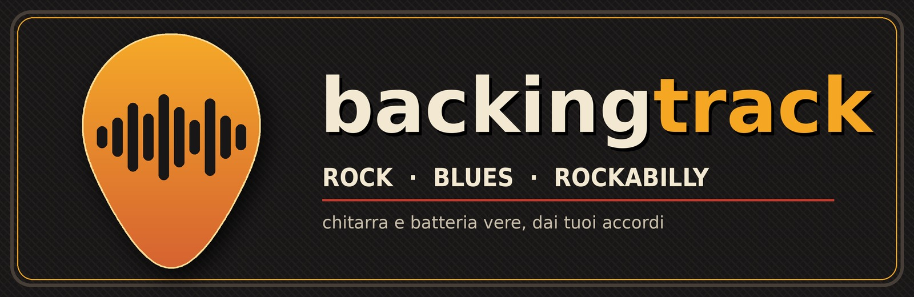
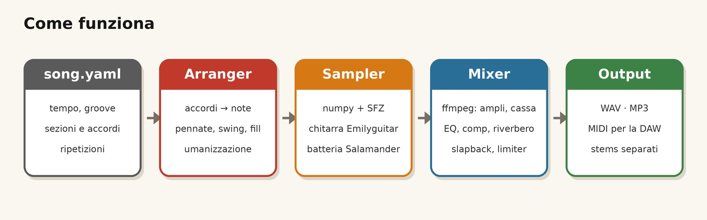
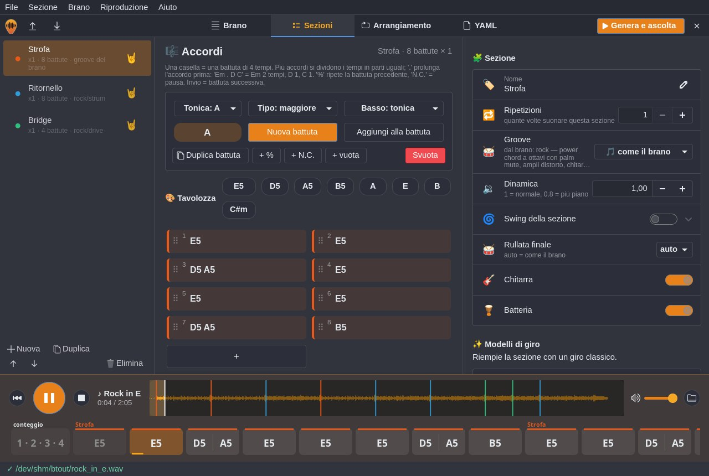
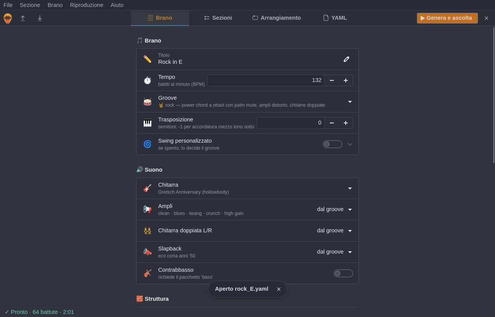

<p align="center">
  
</p>

<p align="center">
  <b>Scrivi gli accordi, scegli il groove, suona sopra.</b><br>
  Backing track con chitarra ritmica e batteria <i>campionate da strumenti veri</i>, generate da un semplice file YAML.
</p>

<p align="center">
  
  
  
  
  
</p>

---

## 📑 Indice

- [✨ Caratteristiche](#-caratteristiche)
- [⚙️ Come funziona](#️-come-funziona)
- [📦 Installazione](#-installazione)
- [🔄 Aggiornare, 🩺 diagnosi e 🗑️ disinstallare](#-aggiornare--diagnosi-e-️-disinstallare)
- [🚀 Avvio rapido](#-avvio-rapido)
- [🖥️ Editor grafico](#️-editor-grafico)
- [🎓 Tutorial: la tua prima backing track](#-tutorial-la-tua-prima-backing-track)
- [💡 Esempi](#-esempi)
- [📝 Formato della canzone](#-formato-della-canzone)
- [🎼 Come si legge una battuta](#-come-si-legge-una-battuta)
- [🥁 Groove disponibili](#-groove-disponibili)
- [🎸 Accordi supportati](#-accordi-supportati)
- [🖥️ Riferimento comandi](#️-riferimento-comandi)
- [📚 Brani di esempio inclusi](#-brani-di-esempio-inclusi)
- [🗂️ Struttura del progetto](#️-struttura-del-progetto)
- [❓ FAQ e problemi comuni](#-faq-e-problemi-comuni)
- [🙏 Crediti e licenze](#-crediti-e-licenze)

---

## ✨ Caratteristiche

- 🎸 **Chitarra vera**: una Gretsch Anniversary hollowbody campionata nota per nota, con più dinamiche
  e round robin, più i veri colpi **staccato** per palm mute e chop. Voicing barré, pennate giù/su,
  bicordi boogie, boom-chick. Ogni corda si comporta come una corda: una nota alla volta.
- 🔊 **Ampli e casse vere**: 5 suoni (clean, blues, twang, crunch, high gain); la cassa è una vera Marshall 4×12
  (Greenback o V30) riprodotta con le sue *impulse response*;
  nel rock la chitarra è **doppiata L/R** come in studio; nel rockabilly c'è lo **slapback**.
- 🥁 **Batteria acustica campionata**: Salamander Drumkit, fino a 20 round robin per pezzo,
  hi-hat aperto/chiuso, ghost note, variazioni ogni 4 battute, **rullate** a fine sezione, piatto sugli attacchi.
- 🎻 **Contrabbasso opzionale** (pizzicato) con walking, root-fifth o ottavi.
- 🔁 **Sezioni ripetibili**: `repeat: 2` o un `arrangement` tipo `[Intro, Strofa x2, Rit, Strofa, Rit x2]`.
- 🎚️ **23 groove** tra rock, blues, rockabilly, country e jazz (half-time, galoppo, rhumba, funk, stop-time, boom-chick…), anche diversi sezione per sezione.
- 🧑‍🎤 **Suona umano**: micro-timing, velocity variabile, velocità della pennata legata alla dinamica, swing regolabile.
- 🎛️ **Mix automatico**: EQ, compressione, riverbero a convoluzione, bilanciamento, limiter e loudness costante.
- 🖥️ **Editor grafico** (GTK 4): sezioni colorate, griglia delle battute con **drag & drop** degli accordi,
  modelli di giro in ogni tonalità, validazione mentre scrivi, **player con forma d'onda e striscia degli accordi**
  che scorre con la musica, bozza automatica.
- 📤 **Output**: WAV, MP3, **MIDI** (per la tua DAW) e **stems** separati.
- 🎯 **Per esercitarsi**: `--mute guitar` per la sola batteria, `--tempo 80` per rallentare, `--transpose -1` per accordature ribassate.
- ⚡ **Veloce**: 2 minuti di brano in circa 5 secondi.
- 💻 **Portabile**: Python + numpy + ffmpeg. Linux, macOS, Windows.
- 📚 **67 brani di esempio** con le progressioni di classici blues, rock e rockabilly.

---

## ⚙️ Come funziona

<p align="center"></p>

1. **`song.yaml`** — descrivi tempo, groove e sezioni con gli accordi, battuta per battuta.
2. **Arranger** — trasforma ogni accordo in un *voicing* sulle 6 corde e applica il pattern del groove:
   pennate (con lo sfasamento reale tra una corda e l'altra), swing, accenti, fill, variazioni, umanizzazione.
   Il risultato è una lista di note, come in un MIDI.
3. **Sampler** — per ogni nota sceglie il campione giusto (tasto, dinamica, round robin), lo intona
   e lo mette nel punto esatto della traccia. Lo fa un piccolo motore scritto in **numpy** che legge
   il formato **SFZ**, lo standard aperto per gli strumenti campionati.
4. **Mixer** — **ffmpeg** fa passare la chitarra "diretta" (DI) in una catena ampli + cassa, comprime ed equalizza
   la batteria, aggiunge slapback e riverbero, bilancia i volumi e porta tutto a un livello d'ascolto costante.
5. **Output** — WAV/MP3 da ascoltare, MIDI da aprire in una DAW, stems per mixare a piacere.

### 🧰 Strumenti usati e perché

| Strumento | Ruolo | Perché questo |
|---|---|---|
| 🐍 **Python 3.8+** | tutto il programma | ovunque, facile da leggere e modificare |
| 🔢 **numpy** | motore di campionamento, bilanciamento, riverbero | somma migliaia di note in pochi secondi, senza compilare niente |
| 📄 **PyYAML** | legge il file canzone | YAML è leggibile e si scrive a mano senza fatica |
| 🎬 **ffmpeg** | ampli, cassa (convoluzione `afir`), EQ, compressori, riverbero, limiter, MP3, conversione FLAC | filtri audio professionali in C, velocissimi, installabile su ogni sistema |
| 🎹 **SFZ** | formato degli strumenti | standard aperto (testo + WAV): librerie di qualità gratuite e con licenze chiare |
| 🎸 **Black & Green Guitars** | campioni di chitarra (Gretsch) | campionata ogni semitono, con staccato; registrata in diretta (DI), quindi l'ampli si sceglie dopo |
| 🔈 **Jester's IR** | casse per chitarra | impulse response di Marshall 4×12 microfonate: il suono di una cassa vera, via convoluzione |
| 🥁 **Salamander Drumkit** | campioni di batteria | kit acustico vero, tante dinamiche e round robin: niente "effetto mitraglietta" |

**Perché non un soundfont General MIDI con fluidsynth?** È stata la prima versione: veloce da scrivere, ma
le chitarre GM suonano finte. Qui ogni strumento è una libreria multicampionata dedicata, e la chitarra
passa da un ampli simulato come si fa in studio.

**Perché non usare direttamente un sampler esterno (sfizz, LinuxSampler)?** Non sono disponibili in modo
uniforme su tutti i sistemi. Il motore interno in numpy legge solo il sottoinsieme di SFZ che serve ed
è portabile ovunque giri Python.

---

## 📦 Installazione

### ⚡ Installazione con un comando

**Linux / macOS**

```sh
curl -fsSL https://raw.githubusercontent.com/wdog/backingtrack/main/install.sh | bash
```

**Windows** (PowerShell)

```powershell
irm https://raw.githubusercontent.com/wdog/backingtrack/main/install.ps1 | iex
```

Lo script controlla Python, installa ffmpeg se manca (chiedendo conferma), installa `backingtrack`
(con `pipx` se c'è, altrimenti in un virtualenv dedicato) e scarica i campioni.
**Rilanciarlo equivale ad aggiornare**: reinstalla il programma e scarica solo i campioni che mancano.
Opzioni: `BT_BASS=1` aggiunge il contrabbasso, `BT_NO_SAMPLES=1` salta i campioni, `BT_YES=1` non fa domande.

```sh
curl -fsSL https://raw.githubusercontent.com/wdog/backingtrack/main/install.sh | BT_BASS=1 bash
```

### 🔧 Installazione manuale

#### 1. ffmpeg

| Sistema | Comando |
|---|---|
| 🐧 Debian / Ubuntu | `sudo apt install ffmpeg python3-pip` |
| 🐧 Fedora | `sudo dnf install ffmpeg` |
| 🐧 Arch | `sudo pacman -S ffmpeg` |
| 🍎 macOS | `brew install ffmpeg` |
| 🪟 Windows | `winget install Gyan.FFmpeg` oppure `choco install ffmpeg` |

Per l'**editor grafico** (opzionale) servono anche GTK 4 e libadwaita con i binding Python:

| Sistema | Comando |
|---|---|
| 🐧 Debian / Ubuntu | `sudo apt install python3-gi gir1.2-gtk-4.0 gir1.2-adw-1` |
| 🐧 Fedora | `sudo dnf install python3-gobject gtk4 libadwaita` |
| 🐧 Arch | `sudo pacman -S python-gobject gtk4 libadwaita` |
| 🍎 macOS | `brew install pygobject3 gtk4 libadwaita` |

#### 2. backingtrack

```sh
git clone https://github.com/wdog/backingtrack.git
cd backingtrack
pipx install --system-site-packages .     # oppure: pip install .
```

`--system-site-packages` permette al programma di vedere GTK installato dal sistema: senza, la riga di comando
funziona ma `backingtrack gui` no.

Senza installare niente puoi anche usare `python3 -m backingtrack` dalla cartella del progetto
(servono `pip install numpy pyyaml`).

#### 3. Campioni (una volta sola)

```sh
backingtrack setup          # chitarra + batteria + casse: ~300 MB
backingtrack setup --bass   # aggiunge il contrabbasso: ~56 MB
backingtrack doctor         # cosa è installato e quanto spazio occupa
```

### 💾 Perché ~300 MB?

Un suono realistico viene da **registrazioni vere**: ogni nota della chitarra e ogni colpo di batteria
sono file audio separati, registrati a più dinamiche (piano, medio, forte) e più volte (i *round robin*,
così due colpi di fila non sono mai identici). Il programma in sé pesa meno di 200 KB: lo spazio è tutto campioni.

`setup` **non scarica le librerie intere**: legge le mappe SFZ e prende **solo i campioni che il programma usa**,
e al massimo 2 round robin per la chitarra e 6 per la batteria. Rispetto alle librerie complete il download scende da ~1,2 GB a ~300 MB.

| Pacchetto | Cosa contiene | `setup` | `setup --full` |
|---|---|---|---|
| `gretsch` 🎸 | Gretsch Anniversary: note normali + staccato, E2–E6 | ~175 MB | ~270 MB |
| `drums` 🥁 | Salamander Drumkit: cassa, rullante, hi-hat, tom, ride, crash | ~120 MB (salvata ~145 MB) | ~185 MB |
| `cabs` 🔈 | 21 impulse response di casse Marshall 4×12 | ~5 MB | ~5 MB |
| `bass` 🎻 | contrabbasso pizzicato (solo con `--bass`) | ~56 MB | ~130 MB |
| `epiphone` 🎸 | chitarra alternativa, Epiphone solid body (opzionale) | ~40 MB | ~100 MB |
| `archtop` 🎸 | chitarra archtop Shinyguitar, pickup magnetico (opzionale) | ~106 MB | ~212 MB |
| `archtop_mic` 🎸 | la stessa archtop microfonata, suono acustico (opzionale) | ~106 MB | ~212 MB |
| `ebass` 🎸 | basso elettrico Black & Blue 'darkblack', a dita (opzionale) | ~80 MB | ~160 MB |
| `sneakybass` 🎻 | contrabbasso Sneakybass, pizzicato leggero (opzionale) | ~63 MB | ~124 MB |

- **Vuoi il massimo?** `backingtrack setup --full` scarica tutti i round robin: più varietà, circa il doppio dello spazio.
- **Vuoi liberare spazio?** `backingtrack remove bass` (o qualsiasi pacchetto); per cancellare tutto elimina la cartella dei campioni.
- **Dove finiscono?** In `~/.local/share/backingtrack` (Linux), `~/Library/Application Support/backingtrack` (macOS)
  o `%LOCALAPPDATA%\backingtrack` (Windows). Puoi cambiare cartella con la variabile `BACKINGTRACK_HOME`
  (es. un disco esterno).
- Si scarica **una volta sola**: poi il programma funziona offline.

---

## 🔄 Aggiornare, 🩺 diagnosi e 🗑️ disinstallare

### 🔄 Aggiornare

```sh
backingtrack update
```

Scarica **solo i campioni che mancano** (quelli già presenti restano dove sono, niente download inutili)
e poi aggiorna il programma da GitHub, mantenendo il supporto alla GUI. In alternativa rilancia l'installer:
fa la stessa cosa.

| Comando | A cosa serve |
|---|---|
| `backingtrack update` | aggiorna alla versione `main` |
| `backingtrack update --ref v1.1` | installa un branch o un tag preciso |
| `backingtrack update --src ~/backingtrack` | aggiorna da una copia locale: utile per provare le modifiche prima di pubblicarle |

Se lavori sul codice (cartella con `.git`), `update` ti ricorda di usare `git pull` e si limita ai campioni.

### 🧪 Provare una copia locale (prima di pubblicare)

Dalla cartella del progetto puoi reinstallare tutto **come lo riceverebbe un utente**, senza passare da GitHub:

```sh
cd ~/Workspace/tracks                       # la cartella del progetto
pipx uninstall backingtrack                 # toglie l'installazione attuale (i campioni restano)
BT_SRC="$PWD" bash install.sh               # installer completo, ma dal codice locale
backingtrack doctor
```

I campioni già scaricati vengono saltati. Per provare anche il primo download da zero, prima cancellali:
`rm -rf ~/.local/share/backingtrack ~/.cache/backingtrack` (poi ~300 MB da riscaricare).

Per lavorare sul codice senza reinstallare a ogni modifica: `pipx install -e --system-site-packages .`
(editable: il comando usa direttamente i file della cartella).

### 🩺 Diagnosi

```sh
backingtrack doctor
```

```
♪ backingtrack 1.0.0  — diagnosi

Programma
  ✓ versione     1.0.0
  ✓ installato   pipx (~/.local/share/pipx/venvs/backingtrack)
  ✓ python       3.12.3

Dipendenze
  ✓ ffmpeg       6.1.1
  ✓ numpy        1.26.4
  ✓ PyYAML       6.0.1
  ✓ GUI          GTK 4.14 · libadwaita 1.5  backingtrack gui

Campioni  ~/.local/share/backingtrack/packs
  ✓ gretsch        175 MB  Black & Green Guitars  376 file
  ✓ drums          144 MB  Salamander Drumkit  209 file
  ✓ cabs             2 MB  Jester's Emerald + Brutal IR  21 file
  · bass         non installato  opzionale: backingtrack setup bass
    totale       321 MB

Tutto pronto! 🎸
```

Controlla programma, dipendenze (anche la GUI), campioni, **rilegge alcuni file a caso** per scoprire campioni
rovinati e mostra le cartelle usate. Se qualcosa non va, chiude con l'elenco numerato di **cosa fare**, con il comando
giusto per il tuo sistema.

### 🗑️ Disinstallare

Il programma e i campioni stanno in posti diversi: puoi togliere uno, l'altro o tutto.

```sh
# 1. il programma
pipx uninstall backingtrack                       # se installato con pipx (o con l'installer e pipx)
rm -rf ~/.local/share/backingtrack/venv ~/.local/bin/backingtrack   # se installato dall'installer senza pipx

# 2. i campioni, le bozze e la cache
rm -rf ~/.local/share/backingtrack ~/.cache/backingtrack
```

| Sistema | Cartella dati (campioni, bozza) | Cartella cache |
|---|---|---|
| 🐧 Linux | `~/.local/share/backingtrack` | `~/.cache/backingtrack` |
| 🍎 macOS | `~/Library/Application Support/backingtrack` | `~/Library/Caches/backingtrack` |
| 🪟 Windows | `%LOCALAPPDATA%\backingtrack\data` (e `\venv`) | `%LOCALAPPDATA%\backingtrack\cache` |

Su Windows togli anche `%LOCALAPPDATA%\backingtrack\venv\Scripts` dalla variabile PATH dell'utente.
Per liberare spazio senza disinstallare: `backingtrack remove bass` (o un altro pacchetto).

---

## 🚀 Avvio rapido

```sh
backingtrack examples/blues/sweet_home_chicago.yaml
```

```
♪ Sweet Home Chicago (progressione) | 125 BPM | 52 battute | 1:45
   Intro        x1  [blues]             | B7 | A7 | E7 | B7 |
   Strofa       x4  [blues]             | E7 | A7 | E7 | E7 | A7 | A7 | E7 | E7 | B7 | A7 | E7 | B7 |
   WAV   out/sweet_home_chicago.wav
   MIDI  out/sweet_home_chicago.mid   (4.8s)
```

Il risultato è in `out/`. Aprilo con qualsiasi player e suonaci sopra. 🎶

Preferisci il mouse? `backingtrack gui` 👇

---

## 🖥️ Editor grafico

```sh
backingtrack gui                 # nuovo brano
backingtrack gui mio_brano.yaml  # apri un brano
```

<p align="center"></p>

La finestra ha tre schede e mostra solo l'essenziale: il pulsante **⚙ Avanzate** (o Brano ▸ Impostazioni avanzate)
apre le impostazioni di dettaglio, e la scelta viene ricordata. Le spiegazioni stanno nei tooltip: passa col mouse
su una voce per leggerle.

**🎵 Brano**: titolo, tempo, groove, contrabbasso e l'**ordine delle sezioni** (con ripetizioni e durata totale;
lista vuota = ordine della pagina Sezioni). Tra le avanzate: chitarra e ampli, doppiatura, slapback, conteggio,
finale, rullate, trasposizione, swing, umanizzazione e output. Ogni scelta ha il suo menu e non si può inserire un
valore fuori scala.

<p align="center"></p>

**🧩 Sezioni**: il cuore dell'editor, su tre colonne affiancate.
- **a sinistra** l'elenco delle sezioni, ognuna col suo colore e l'emoji dello stile (🤘 rock, 🎷 blues, 🕺 rockabilly,
  🤠 country), con **Nuova** e i pulsanti per duplicare, riordinare ed eliminare;
- **al centro gli accordi**:
  - scegli **tonica** e **basso** da una griglia di note (naturali, diesis, bemolle) e il **tipo** da una griglia
    (m, 7, maj7, sus4…), poi **Nuova battuta** o **Aggiungi alla battuta**; il pulsante ⓘ ricorda come si
    scrivono le battute;
  - la **🎨 tavolozza** mostra l'accordo costruito e quelli già usati nel brano: **trascinali su una battuta**
    per metterli lì, o cliccali per aggiungere una battuta;
  - le battute sono una **griglia compatta** (4 per riga) col bordo nel colore della sezione. Trascina la maniglia
    `⠿` per **spostare una battuta**, usa il **tasto destro** per duplicarla, inserirne una prima/dopo, svuotarla o
    eliminarla, e il `＋` in fondo per aggiungerne (ci puoi trascinare sopra un accordo). Passando col mouse leggi
    la battuta (*Em 2 tempi · D 1 · C 1*); se c'è un errore la cella diventa rossa e spiega cosa correggere;
- **a destra** le impostazioni della sezione (nome, ripetizioni, groove; tra le avanzate dinamica, swing, rullata,
  strumenti) e i
  **modelli di giro**: 12-bar blues, 8-bar, blues minore, I-IV-V, anni '50, pop-rock… in qualsiasi tonalità.

Il **groove** si sceglie da un menu diviso per stile (🤘 Rock ▸, 🎷 Blues ▸, 🕺 Rockabilly ▸, 🤠 Country ▸) con la
descrizione di ogni voce; le altre scelte (chitarra, ampli, rullata…) sono menu a tendina compatti.
Con la finestra stretta le colonne si impilano (accordi in alto).

**📄 YAML**: il file che verrà salvato, sempre aggiornato, da copiare con un clic.

In basso la **barra di stato** dice se il brano è pronto (✓ verde, con battute e durata) o cosa correggere (⚠).
**Genera e ascolta** (`Alt+G`) crea l'audio **anche se non hai salvato** e lo suona subito nel player integrato.

### 🎧 Il player

- pulsanti grandi **da capo**, **play/pausa**, **stop**, titolo, tempo e **battuta corrente** (*Battuta 6 / 64 · Strofa*);
- la **forma d'onda** del brano con una linea colorata e il nome dove inizia ogni sezione: clicca o trascina per spostarti;
- la **striscia degli accordi**: tutte le battute del brano in fila, ognuna larga quanto serve per leggere ogni
  accordo, divise in proporzione ai tempi, col numero di battuta in piccolo. La battuta che suona è evidenziata e si riempie mentre avanza, la striscia
  scorre da sola (puoi scorrerla anche a mano) e un clic su una battuta salta lì. C'è anche il conteggio iniziale e il finale;
- volume e pulsante per aprire la cartella dei file generati.

### 💾 Salvataggio e bozza automatica

File ▸ **Salva** (Ctrl+S) e **Salva con nome** (Ctrl+Shift+S) scrivono il file YAML. Se chiudi con modifiche non
salvate la finestra chiede cosa fare. In più ogni modifica finisce in una **bozza automatica**: se il programma
si chiude male o scegli "Non salvare" per sbaglio, alla riapertura ti propone di **ripristinarla**.

### ⌨️ Scorciatoie

| Tasto | Azione |
|---|---|
| `Ctrl+N` / `Ctrl+O` | nuovo / apri |
| `Ctrl+S` / `Ctrl+Shift+S` | salva / salva con nome |
| `Alt+G` (o `Ctrl+R`) | genera e ascolta |
| `Ctrl+T` / `Ctrl+D` | nuova sezione / duplica sezione |
| `Ctrl+B` / `Ctrl+Shift+D` | nuova battuta / duplica battuta |
| `Invio` (in una battuta) | passa alla battuta successiva (la crea se serve) |
| `Spazio` | play / pausa |
| `B` | riparti da capo |
| `S` | stop |
| `Ctrl+Q` | esci |

Spazio, B e S funzionano quando **non** stai scrivendo in un campo: così puoi digitare `Bb` o `Dsus4` senza problemi.
Il menu **File ▸ Apri esempio** carica al volo uno dei brani inclusi (gli esempi sono installati col programma).

---

## 🎓 Tutorial: la tua prima backing track

### Passo 1 — crea il file

```sh
backingtrack new mia_canzone.yaml
```

Si crea un file di esempio già commentato. Aprilo con un editor di testo.

### Passo 2 — tempo e groove

```yaml
title: Il mio blues
tempo: 96          # battiti al minuto
groove: blues      # vedi "backingtrack grooves"
```

### Passo 3 — scrivi gli accordi

Ogni `|` separa una battuta da 4/4. Puoi andare a capo quando vuoi.

```yaml
sections:
  - name: Strofa
    chords: |
      | A7 | D7 | A7 | A7 |
      | D7 | D7 | A7 | A7 |
      | E7 | D7 | A7 | E7 |
```

Due accordi nella stessa battuta si dividono i tempi: `| A7 D7 |` = 2 + 2.
Il punto prolunga l'accordo: `| C . . G |` = 3 + 1.

### Passo 4 — ripeti le sezioni

```yaml
  - name: Strofa
    repeat: 3        # suona 3 volte questa sezione
```

Oppure scegli l'ordine completo con `arrangement` (sovrascrive `repeat`):

```yaml
arrangement: [Intro, Strofa x2, Solo, Strofa, Finale]
```

### Passo 5 — genera e ascolta

```sh
backingtrack mia_canzone.yaml --mp3
```

### Passo 6 — personalizza

```sh
backingtrack mia_canzone.yaml --tempo 80          # più lento per studiare
backingtrack mia_canzone.yaml --transpose 2       # un tono sopra
backingtrack mia_canzone.yaml --groove blues/slow # prova un altro groove
backingtrack mia_canzone.yaml --bass              # aggiungi il contrabbasso
backingtrack mia_canzone.yaml --mute guitar       # solo batteria (suoni tu la ritmica)
backingtrack mia_canzone.yaml --stems             # tracce separate
```

Consiglio: con `--dry-run` controlli la struttura in un istante senza generare audio.

---

## 💡 Esempi

### 12-bar blues con intro e solo

```yaml
title: 12-bar blues in A
tempo: 100
groove: blues

sections:
  - name: Intro
    chords: "| E7 | D7 | A7 | E7 |"      # turnaround
  - name: Strofa
    repeat: 3
    chords: |
      | A7 | D7 | A7 | A7 |
      | D7 | D7 | A7 | A7 |
      | E7 | D7 | A7 | E7 |
  - name: Solo
    groove: blues/7                       # boogie con la settima
    repeat: 2
    chords: |
      | A7 | D7 | A7 | % |
      | D7 | %  | A7 | % |
      | E7 | D7 | A7 D7 | A7 E7 |
```

### Canzone rock: strofa palm mute, ritornello aperto

```yaml
title: Rock in E
tempo: 132
groove: rock                    # power chord con palm mute, chitarre doppiate

sections:
  - name: Strofa
    chords: |
      | E5 | E5 | D5 A5 | E5 |
      | E5 | E5 | D5 A5 | B5 |
  - name: Ritornello
    groove: rock/strum          # accordi aperti in crunch
    chords: "| A | E | B | E |"
  - name: Bridge
    groove: rock/drive
    volume: 0.9                 # un po' più piano
    chords: "| C#m | A | E | B |"

arrangement: [Strofa x2, Ritornello x2, Strofa, Ritornello x2, Bridge x2, Ritornello x2]
```

### Rockabilly con contrabbasso e slapback

```yaml
title: Rockabilly in E
tempo: 172
groove: rockabilly      # boom-chick + train beat
bass: true

sections:
  - name: Strofa
    repeat: 2
    chords: |
      | E | E | E | E7 |
      | A | A | E | E |
      | B7 | A7 | E | B7 |
  - name: Solo
    groove: rockabilly/boogie
    chords: |
      | E | % | % | % |
      | A | % | E | % |
      | B | A | E | B |
```

### Intro solo chitarra, finale personalizzato

```yaml
title: Ballad
tempo: 70
groove: rock/ballad
ending_chord: Gadd9     # accordo finale (default: il primo del brano)
count_in: false

sections:
  - name: Intro
    drums: false        # la batteria entra dopo
    chords: "| G | D/F# | Em | C |"
  - name: Strofa
    repeat: 2
    chords: "| G | D/F# | Em | C | G | D | C | C |"
```

### Pausa e stop

```yaml
    chords: "| A7 | A7 | N.C. | E7 |"    # N.C. = la chitarra tace per una battuta
```

### Sessione di studio

```sh
# genera tutti i blues a 80 BPM, solo batteria e basso, in mp3
backingtrack render examples/blues/*.yaml --tempo 80 --mute guitar --bass --mp3 -o studio/
```

---

## 📝 Formato della canzone

### Chiavi principali

| Chiave | Default | Descrizione |
|---|---|---|
| `title` | nome file | titolo |
| `tempo` | `120` | BPM (30-320) |
| `groove` | `rock` | groove di default ([elenco](#-groove-disponibili)) |
| `sections` | — | elenco delle sezioni (obbligatorio) |
| `arrangement` | ordine delle sezioni | es. `[Intro, Strofa x2, Rit]` |
| `transpose` | `0` | semitoni (+/-) |
| `swing` | dal groove | 0 = dritto … 1 = terzinato |
| `count_in` | `true` | una battuta di bacchette prima di partire |
| `ending` | `true` | accordo finale con piatto |
| `ending_chord` | primo accordo | accordo del finale |
| `fills` | `true` | rullata sull'ultima battuta di ogni sezione |
| `crash` | `true` | piatto all'inizio di ogni sezione |
| `bass` | `false` | `true` = contrabbasso, oppure `ebass` (elettrico) o `sneakybass` (serve `setup <nome>`) |
| `guitar` | `gretsch` | chitarra: `gretsch` (hollowbody), `epiphone` (solid body), `archtop`, `archtop_mic` (servono `setup <nome>`) |
| `amp` | dal groove | forza l'ampli: `clean` `blues` `twang` `crunch` `high` |
| `double` | dal groove | chitarra doppiata a sinistra e destra |
| `slapback` | dal groove | eco slapback rockabilly |
| `humanize` | `1.0` | 0 = perfettamente a tempo, 2 = molto "umano" |
| `strum_ms` | `14` | millisecondi tra una corda e l'altra nella pennata |
| `seed` | `1` | cambia per avere variazioni diverse di round robin e timing |

### Chiavi delle sezioni

| Chiave | Default | Descrizione |
|---|---|---|
| `name` | `Sezione N` | nome usato in `arrangement` |
| `chords` | — | battute (obbligatorio) |
| `repeat` | `1` | quante volte suonarla |
| `groove` | quello del brano | groove della sezione |
| `swing` | — | swing della sezione |
| `volume` | `1.0` | dinamica (es. `0.8` per una strofa più piano) |
| `fill` | `fills` | rullata a fine sezione |
| `guitar` / `drums` | `true` | `false` per togliere lo strumento nella sezione |

---

## 🎼 Come si legge una battuta

Ogni battuta ha **4 tempi**. I simboli scritti nella battuta si dividono i 4 tempi **in parti uguali**,
e il punto `.` **prolunga l'accordo che lo precede** di una parte.

Prendiamo `Em . D C`. Sono 4 simboli, quindi ognuno vale 1 tempo:

| tempo | 1 | 2 | 3 | 4 |
|---|---|---|---|---|
| simbolo | `Em` | `.` | `D` | `C` |
| suona | **Em** | Em (continua) | **D** | **C** |

Quindi: **Em per 2 tempi, D per 1, C per 1**. Nell'editor grafico basta passare col mouse sulla battuta: *Em 2 tempi · D 1 · C 1*, e nella striscia del player Em occupa metà casella.

| Scrittura | Significato |
|---|---|
| `\| A7 \|` | A7 per tutta la battuta |
| `\| A7 D7 \|` | due accordi: 2 tempi ciascuno |
| `\| C G Am F \|` | un accordo per tempo |
| `\| Em . D C \|` | Em 2 tempi, D 1, C 1 |
| `\| C . . G \|` | C 3 tempi, G 1 |
| `\| C G F \|` | tre accordi: 1⅓ tempi ciascuno (possibile ma insolito) |
| `\| % \|` | ripete la battuta precedente |
| `\| N.C. \|` | niente chitarra, la batteria continua |

Errori comuni, con il messaggio che ricevi:

| Scrivi | Problema | Correggi |
|---|---|---|
| `. D` | il `.` prolunga l'accordo precedente, quindi non può aprire la battuta | `D` oppure `Em . D C` |
| `am` | la tonica va maiuscola | `Am` |
| `H7` | in notazione inglese il Si è `B` | `B7` |
| `%` come prima battuta | non c'è una battuta precedente da ripetere | scrivi l'accordo |
| `A B C D E` | più di 4 simboli (uno per tempo al massimo) | dividi su due battute |

---

## 🥁 Groove disponibili

| Groove | Ampli | Chitarra | Batteria |
|---|---|---|---|
| 🤘 `rock` | high | power chord a ottavi con palm mute, ampli distorto, chitarre doppiate · doppiata L/R | rock: cassa 1-3-3&, rullante 2-4, hi-hat a ottavi |
| 🤘 `rock/strum` | crunch | accordi aperti D . D U . U D U, crunch, chitarre doppiate · doppiata L/R | rock: cassa 1-3-3&, rullante 2-4, hi-hat a ottavi |
| 🤘 `rock/drive` | crunch | pennate giù a ottavi, accordi pieni (punk/drive) · doppiata L/R | rock: cassa 1-3-3&, rullante 2-4, hi-hat a ottavi |
| 🤘 `rock/ballad` | clean | accordi lunghi e pennate leggere, batteria half-time | half-time, rullante sul 3 |
| 🤘 `rock/halftime` | high | half-time pesante, power chord lunghi e rullante sul 3 · doppiata L/R | half-time pesante, rullante sul 3 |
| 🤘 `rock/gallop` | high | galoppo (ottavo + due sedicesimi) in palm mute, stile heavy metal classico · doppiata L/R | cassa al galoppo, rullante 2-4 |
| 🤘 `rock/pop` | crunch | pennate a sedicesimi D D DU DU, crunch leggero · doppiata L/R | rock: cassa 1-3-3&, rullante 2-4, hi-hat a ottavi |
| 🎷 `blues` | blues | shuffle boogie 5-6 (stile Jimmy Reed) · swing 1 | shuffle con hi-hat terzinato |
| 🎷 `blues/7` | blues | shuffle boogie 5-6-b7-6 · swing 1 | shuffle con hi-hat terzinato |
| 🎷 `blues/strum` | blues | accordi pieni in shuffle (D . D U . U D U) · swing 1 | shuffle con hi-hat terzinato |
| 🎷 `blues/slow` | blues | pennate sulle terzine, ride | ride sulle terzine, 12/8 |
| 🎷 `blues/rhumba` | blues | boogie dritto con ritmo latino e side-stick | ritmo latino con side-stick |
| 🎷 `blues/funk` | clean | chop a sedicesimi (chicken scratch) su accordi di nona | funk a sedicesimi con ghost note |
| 🎷 `blues/stop` | blues | un colpo secco sul primo tempo, poi silenzio (per le strofe cantate) · swing 1 | un colpo sul primo tempo |
| 🕺 `rockabilly` | twang | boom-chick (basso/accordo) + train beat, slapback · slapback, swing 0.5 | train beat: rullante a ottavi con accenti |
| 🕺 `rockabilly/boogie` | twang | boogie 5-6 swing veloce, slapback · slapback, swing 0.6 | swing rockabilly |
| 🕺 `rockabilly/strum` | twang | accordi pieni sul battere, chop su 2 e 4, slapback · slapback, swing 0.6 | swing rockabilly |
| 🤠 `country` | twang | boom-chick dritto, basso alternato e spazzolata sul 2 e 4 | spazzolata sul 2 e 4, hi-hat a pedale |
| 🤠 `country/shuffle` | twang | boom-chick in swing, stile Texas / honky-tonk · swing 0.7 | shuffle con hi-hat terzinato |
| 🎺 `jazz` | clean | comping a semiminime alla Freddie Green, voicing jazz a 4 note · swing 1 | ride "ding ding-da", charleston su 2 e 4 |
| 🎺 `jazz/charleston` | clean | comping Charleston (1 e levare del 2), accordi corti · swing 1 | ride jazz |
| 🎺 `jazz/ballad` | clean | accordi lunghi e morbidi, basso in due · swing 1 | spazzole (rullante leggero), ride sul 1 e 3 |
| 🎺 `jazz/bossa` | clean | bossa nova: basso alternato col pollice e accordi sincopati | cross-stick, cassa bossa, hi-hat leggero |

`backingtrack grooves` mostra l'elenco aggiornato.

---

## 🎸 Accordi supportati

Tonica `A`…`G` con `#` o `b`, poi uno di questi suffissi, e un basso opzionale `/X` (es. `D/F#`):

| Tipo | Suffissi |
|---|---|
| maggiore / minore | *(niente)*, `m`, `min`, `-` |
| settime | `7`, `maj7`, `M7`, `m7`, `mmaj7`, `m7b5`, `ø`, `dim7`, `7sus4` |
| seste e none | `6`, `m6`, `9`, `m9`, `maj9`, `add9`, `13` |
| alterati | `7#9`, `7b9`, `7#5`, `aug`, `+`, `dim`, `°` |
| sospesi | `sus2`, `sus4` |
| power chord | `5` |

---

## 🖥️ Riferimento comandi

```
backingtrack <file.yaml>                  scorciatoia per "render"
backingtrack render <file.yaml>... [opzioni]
    -o, --out PATH       output senza estensione (con più file: cartella). Default out/<nome>
    -t, --tempo BPM      cambia il tempo
    -g, --groove NOME    forza un groove per tutte le sezioni
    --transpose N        trasponi di N semitoni
    --bass               aggiungi il contrabbasso
    --mute guitar,drums  escludi strumenti dall'audio
    --mp3                crea anche l'mp3
    --stems              salva guitar.wav, drums.wav, bass.wav separati
    --midi-only          solo il file MIDI
    --dry-run            mostra la struttura senza generare file
backingtrack setup [pacchetti] [--bass] [--full] [--force]
                                           scarica i campioni (default: gretsch drums cabs)
backingtrack remove <pacchetto>...         cancella campioni e libera spazio
backingtrack update [--ref TAG] [--src DIR]
                                           aggiorna programma e campioni mancanti
backingtrack gui [file.yaml]               editor grafico (anche: backingtrack-gui)
backingtrack grooves                       elenco dei groove
backingtrack new <file.yaml>               crea un file canzone di partenza
backingtrack doctor                        diagnosi completa, con cosa fare se manca qualcosa
```

---

## 📚 Brani di esempio inclusi

In `examples/` ci sono **67 brani** divisi per stile. Contengono **solo la progressione di accordi**
(niente melodia né testo), a scopo didattico; tempi e tonalità sono quelli più comuni o semplificati.

```sh
backingtrack render examples/rockabilly/*.yaml --mp3     # tutto il rockabilly
```

<details>
<summary><b>🎷 Blues</b> — 22 brani</summary>

| File | Brano | BPM | Groove |
|---|---|---|---|
| [`12bar_A_shuffle`](examples/blues/12bar_A_shuffle.yaml) | 12-bar blues in A (shuffle) | 100 | `blues`, `blues/7` |
| [`boom_boom`](examples/blues/boom_boom.yaml) | Boom Boom | 165 | `blues` |
| [`born_under_a_bad_sign`](examples/blues/born_under_a_bad_sign.yaml) | Born Under a Bad Sign | 92 | `blues/strum` |
| [`crossroads`](examples/blues/crossroads.yaml) | Crossroads | 126 | `rock/strum` |
| [`dust_my_broom`](examples/blues/dust_my_broom.yaml) | Dust My Broom | 130 | `blues/7` |
| [`everyday_i_have_the_blues`](examples/blues/everyday_i_have_the_blues.yaml) | Every Day I Have the Blues | 150 | `blues` |
| [`going_down_slow_tore_down`](examples/blues/going_down_slow_tore_down.yaml) | I'm Tore Down | 150 | `blues/7` |
| [`got_my_mojo_working`](examples/blues/got_my_mojo_working.yaml) | Got My Mojo Working | 136 | `blues` |
| [`green_onions`](examples/blues/green_onions.yaml) | Green Onions *(in stile)* | 134 | `blues/strum` |
| [`hoochie_coochie_man`](examples/blues/hoochie_coochie_man.yaml) | Hoochie Coochie Man | 88 | `blues` |
| [`kansas_city`](examples/blues/kansas_city.yaml) | Kansas City | 132 | `blues/7` |
| [`key_to_the_highway`](examples/blues/key_to_the_highway.yaml) | Key to the Highway | 104 | `blues` |
| [`la_grange_boogie`](examples/blues/la_grange_boogie.yaml) | La Grange *(in stile)* | 162 | `blues/7` |
| [`mannish_boy`](examples/blues/mannish_boy.yaml) | Mannish Boy *(in stile)* | 68 | `blues/slow` |
| [`minor_blues_Am`](examples/blues/minor_blues_Am.yaml) | Minor blues in Am | 76 | `blues/slow` |
| [`pride_and_joy`](examples/blues/pride_and_joy.yaml) | Pride and Joy | 118 | `blues/7` |
| [`red_house`](examples/blues/red_house.yaml) | Red House | 62 | `blues/slow` |
| [`since_ive_been_loving_you`](examples/blues/since_ive_been_loving_you.yaml) | Since I've Been Loving You | 58 | `blues/slow` |
| [`stormy_monday`](examples/blues/stormy_monday.yaml) | Stormy Monday | 58 | `blues/slow` |
| [`sweet_home_chicago`](examples/blues/sweet_home_chicago.yaml) | Sweet Home Chicago | 125 | `blues` |
| [`texas_flood`](examples/blues/texas_flood.yaml) | Texas Flood | 60 | `blues/slow` |
| [`the_thrill_is_gone`](examples/blues/the_thrill_is_gone.yaml) | The Thrill Is Gone | 92 | `blues/slow` |

</details>

<details>
<summary><b>🤘 Rock</b> — 22 brani</summary>

| File | Brano | BPM | Groove |
|---|---|---|---|
| [`all_right_now`](examples/rock/all_right_now.yaml) | All Right Now | 120 | `rock/drive`, `rock/strum` |
| [`back_in_black`](examples/rock/back_in_black.yaml) | Back in Black *(in stile)* | 94 | `rock`, `rock/strum` |
| [`brown_eyed_girl`](examples/rock/brown_eyed_girl.yaml) | Brown Eyed Girl | 150 | `rock/strum` |
| [`free_fallin`](examples/rock/free_fallin.yaml) | Free Fallin' | 84 | `rock/ballad` |
| [`gloria`](examples/rock/gloria.yaml) | Gloria | 138 | `rock/drive` |
| [`hey_joe`](examples/rock/hey_joe.yaml) | Hey Joe | 82 | `rock/strum` |
| [`highway_to_hell`](examples/rock/highway_to_hell.yaml) | Highway to Hell *(in stile)* | 116 | `rock`, `rock/strum` |
| [`johnny_b_goode`](examples/rock/johnny_b_goode.yaml) | Johnny B. Goode | 168 | `blues/7` |
| [`knockin_on_heavens_door`](examples/rock/knockin_on_heavens_door.yaml) | Knockin' on Heaven's Door | 68 | `rock/ballad` |
| [`la_bamba`](examples/rock/la_bamba.yaml) | La Bamba | 150 | `rock/strum` |
| [`louie_louie`](examples/rock/louie_louie.yaml) | Louie Louie | 120 | `rock/strum` |
| [`paranoid`](examples/rock/paranoid.yaml) | Paranoid *(in stile)* | 164 | `rock` |
| [`rock_E`](examples/rock/rock_E.yaml) | Rock in E | 132 | `rock`, `rock/drive`, `rock/strum` |
| [`rock_and_roll`](examples/rock/rock_and_roll.yaml) | Rock and Roll | 170 | `rock/drive` |
| [`rockin_all_over_the_world`](examples/rock/rockin_all_over_the_world.yaml) | Rockin' All Over the World | 132 | `rock/drive` |
| [`rockin_in_the_free_world`](examples/rock/rockin_in_the_free_world.yaml) | Rockin' in the Free World | 132 | `rock`, `rock/drive` |
| [`seven_nation_army`](examples/rock/seven_nation_army.yaml) | Seven Nation Army *(in stile)* | 124 | `rock/drive` |
| [`smoke_on_the_water`](examples/rock/smoke_on_the_water.yaml) | Smoke on the Water *(in stile)* | 112 | `rock`, `rock/strum` |
| [`sweet_home_alabama`](examples/rock/sweet_home_alabama.yaml) | Sweet Home Alabama | 98 | `rock/strum` |
| [`twist_and_shout`](examples/rock/twist_and_shout.yaml) | Twist and Shout | 125 | `rock/drive` |
| [`wild_thing`](examples/rock/wild_thing.yaml) | Wild Thing | 108 | `rock/drive`, `rock/strum` |
| [`you_really_got_me`](examples/rock/you_really_got_me.yaml) | You Really Got Me *(in stile)* | 136 | `rock`, `rock/drive` |

</details>

<details>
<summary><b>🕺 Rockabilly</b> — 23 brani</summary>

| File | Brano | BPM | Groove |
|---|---|---|---|
| [`be_bop_a_lula`](examples/rockabilly/be_bop_a_lula.yaml) | Be-Bop-A-Lula | 128 | `rockabilly/strum` |
| [`blue_suede_shoes`](examples/rockabilly/blue_suede_shoes.yaml) | Blue Suede Shoes | 184 | `rockabilly/boogie` |
| [`cmon_everybody`](examples/rockabilly/cmon_everybody.yaml) | C'mon Everybody | 150 | `rockabilly` |
| [`folsom_prison_blues`](examples/rockabilly/folsom_prison_blues.yaml) | Folsom Prison Blues | 216 | `rockabilly` |
| [`great_balls_of_fire`](examples/rockabilly/great_balls_of_fire.yaml) | Great Balls of Fire *(in stile)* | 156 | `rockabilly/boogie` |
| [`heartbreak_hotel`](examples/rockabilly/heartbreak_hotel.yaml) | Heartbreak Hotel | 72 | `blues/slow` |
| [`honey_dont`](examples/rockabilly/honey_dont.yaml) | Honey Don't | 170 | `rockabilly` |
| [`hound_dog`](examples/rockabilly/hound_dog.yaml) | Hound Dog | 174 | `rockabilly/boogie` |
| [`jailhouse_rock`](examples/rockabilly/jailhouse_rock.yaml) | Jailhouse Rock | 168 | `rockabilly/boogie` |
| [`matchbox`](examples/rockabilly/matchbox.yaml) | Matchbox | 165 | `rockabilly` |
| [`maybellene`](examples/rockabilly/maybellene.yaml) | Maybellene | 200 | `rockabilly/boogie` |
| [`mystery_train`](examples/rockabilly/mystery_train.yaml) | Mystery Train | 170 | `rockabilly` |
| [`peggy_sue`](examples/rockabilly/peggy_sue.yaml) | Peggy Sue | 148 | `rockabilly/strum` |
| [`rock_around_the_clock`](examples/rockabilly/rock_around_the_clock.yaml) | Rock Around the Clock | 180 | `rockabilly/boogie` |
| [`rock_this_town`](examples/rockabilly/rock_this_town.yaml) | Rock This Town *(in stile)* | 190 | `rockabilly/strum` |
| [`rockabilly_E`](examples/rockabilly/rockabilly_E.yaml) | Rockabilly in E | 172 | `rockabilly`, `rockabilly/boogie` |
| [`shake_rattle_and_roll`](examples/rockabilly/shake_rattle_and_roll.yaml) | Shake, Rattle and Roll | 175 | `rockabilly/boogie` |
| [`stray_cat_strut`](examples/rockabilly/stray_cat_strut.yaml) | Stray Cat Strut *(in stile)* | 92 | `rockabilly/strum` |
| [`summertime_blues`](examples/rockabilly/summertime_blues.yaml) | Summertime Blues | 150 | `rockabilly/strum` |
| [`thats_all_right`](examples/rockabilly/thats_all_right.yaml) | That's All Right | 160 | `rockabilly` |
| [`train_kept_a_rollin`](examples/rockabilly/train_kept_a_rollin.yaml) | Train Kept A-Rollin' *(in stile)* | 180 | `rockabilly/boogie` |
| [`tutti_frutti`](examples/rockabilly/tutti_frutti.yaml) | Tutti Frutti | 180 | `rockabilly/boogie` |
| [`whole_lotta_shakin`](examples/rockabilly/whole_lotta_shakin.yaml) | Whole Lotta Shakin' Goin' On | 150 | `rockabilly/boogie` |

</details>

<details>
<summary><b>🎺 Jazz</b> — 8 brani</summary>

| File | Brano | BPM | Groove |
|---|---|---|---|
| [`all_of_me`](examples/jazz/all_of_me.yaml) | All of Me | 140 | `jazz/charleston` |
| [`autumn_leaves`](examples/jazz/autumn_leaves.yaml) | Autumn Leaves | 130 | `jazz` |
| [`blue_bossa`](examples/jazz/blue_bossa.yaml) | Blue Bossa | 140 | `jazz/bossa` |
| [`fly_me_to_the_moon`](examples/jazz/fly_me_to_the_moon.yaml) | Fly Me to the Moon | 120 | `jazz` |
| [`jazz_blues_F`](examples/jazz/jazz_blues_F.yaml) | Jazz blues in F | 150 | `jazz` |
| [`rhythm_changes_Bb`](examples/jazz/rhythm_changes_Bb.yaml) | Rhythm changes in Bb | 180 | `jazz` |
| [`so_what`](examples/jazz/so_what.yaml) | So What | 136 | `jazz/charleston` |
| [`take_the_a_train`](examples/jazz/take_the_a_train.yaml) | Take the A Train | 160 | `jazz` |

</details>


---

## 🗂️ Struttura del progetto

```
backingtrack/
├── backingtrack/
│   ├── cli.py         # comandi
│   ├── gui.py         # editor grafico GTK 4 / libadwaita
│   ├── songfile.py    # modello dell'editor: validazione, modelli di giro, YAML
│   ├── data/          # icona dell'app
│   ├── song.py        # lettura YAML, battute, arrangement
│   ├── theory.py      # accordi e voicing sulle corde
│   ├── grooves.py     # pattern di chitarra e batteria
│   ├── arranger.py    # accordi → note (pennate, swing, fill, umanizzazione)
│   ├── sfz.py         # lettore SFZ e WAV
│   ├── render.py      # sampler numpy
│   ├── mixer.py       # ampli, EQ, riverbero, loudness (ffmpeg)
│   ├── packs.py       # download selettivo dei campioni
│   └── midi.py        # export MIDI
├── examples/          # brani di esempio (blues, rock, rockabilly)
├── docs/              # immagini della documentazione
├── tests/             # python -m unittest discover tests
├── install.sh         # installer Linux/macOS
├── install.ps1        # installer Windows
└── pyproject.toml
```

---

## ❓ FAQ e problemi comuni

<details>
<summary><b>"campioni '...' non installati"</b></summary>

Esegui `backingtrack setup`. Con `--bass` serve anche `backingtrack setup bass`, con `guitar: epiphone` serve `backingtrack setup epiphone`.
</details>

<details>
<summary><b>"ffmpeg non trovato nel PATH"</b></summary>

Installa ffmpeg (vedi [Installazione](#-installazione)) e riapri il terminale. `backingtrack doctor` verifica.
</details>

<details>
<summary><b>"backingtrack gui" non parte</b></summary>

Lancia `backingtrack doctor` e guarda la riga **GUI**. Di solito mancano GTK 4 e libadwaita (il comando per
installarli è nel riepilogo finale). Se sono installati ma il programma non li vede, è stato installato con pipx
senza `--system-site-packages`: `backingtrack update` o l'installer lo reinstallano nel modo giusto.
</details>

<details>
<summary><b>Genera senza salvare?</b></summary>

Sì: **Genera e ascolta** usa il brano così com'è nell'editor, salvato o no. Il file audio finisce nella cartella
di output (scheda Brano, default `out/`).
</details>

<details>
<summary><b>Posso usare il MIDI in una DAW?</b></summary>

Sì: ogni render crea anche `out/<nome>.mid` con tracce separate (Guitar L/R, Bass, Drums, batteria in mappa GM).
Con `--midi-only` ottieni solo quello.
</details>

<details>
<summary><b>Il 3/4 o il 6/8?</b></summary>

Per ora solo 4/4. Il feel in 12/8 si ottiene con `blues/slow` (terzine) o con `swing: 1`.
</details>

<details>
<summary><b>Come ottengo variazioni diverse dello stesso brano?</b></summary>

Cambia `seed` nel file: cambiano round robin, micro-timing e dinamiche.
</details>

<details>
<summary><b>Il download dei campioni si interrompe</b></summary>

Rilancia `backingtrack setup` (o `backingtrack update`): i pacchetti già completi vengono saltati.
</details>

---

## 🙏 Crediti e licenze

Il codice è sotto licenza **MIT** (vedi [LICENSE](LICENSE)).

I campioni non sono inclusi nel repository: vengono scaricati dai rispettivi autori con `backingtrack setup`.

| Libreria | Autore | Licenza |
|---|---|---|
| [Black & Green Guitars](https://github.com/sfzinstruments/karoryfer.black-and-green-guitars) | Karoryfer Samples | CC0 1.0 |
| [Jester's Emerald](https://www.jester-dyne-productions.com/emerald-ir-pack/) e [Brutal IR Pack](https://www.jester-dyne-productions.com/brutal-ir-pack/) | Jester Dyne Productions | gratuite, anche per uso commerciale |
| [Emilyguitar](https://github.com/sfzinstruments/karoryfer.emilyguitar) (opzionale) | Karoryfer Samples / D. Smolken | CC0 1.0 |
| [Salamander Drumkit](https://github.com/studiorack/salamander-drumkit) | Alexander Holm | CC-BY-SA 3.0 |
| [Double bass (Rubner 1958)](https://github.com/sfzinstruments/dsmolken.double-bass) | D. Smolken | CC0 1.0 |

Se pubblichi brani fatti con la batteria Salamander, cita l'autore: *"Drums: Salamander Drumkit by Alexander Holm (CC-BY-SA 3.0)"*.

I brani in `examples/` riportano solo progressioni di accordi, che non sono tutelate da copyright; i titoli servono solo a riconoscerle.
