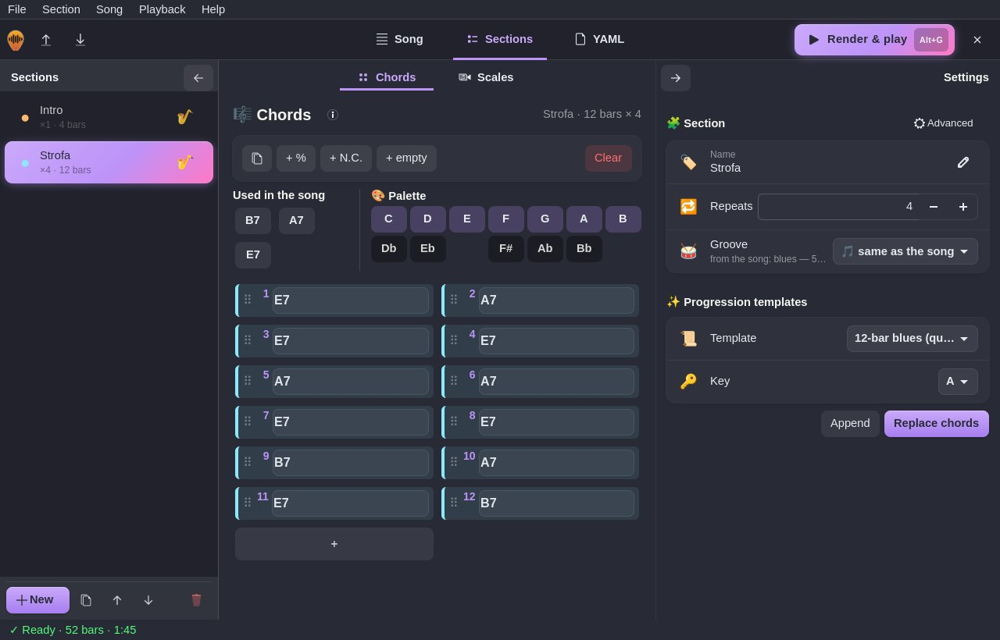
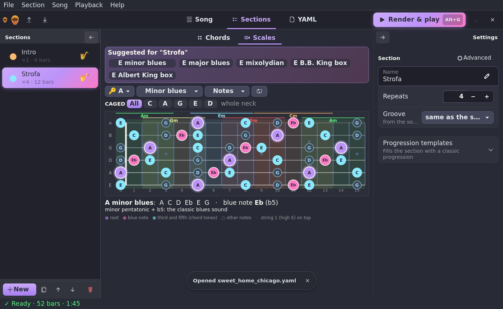
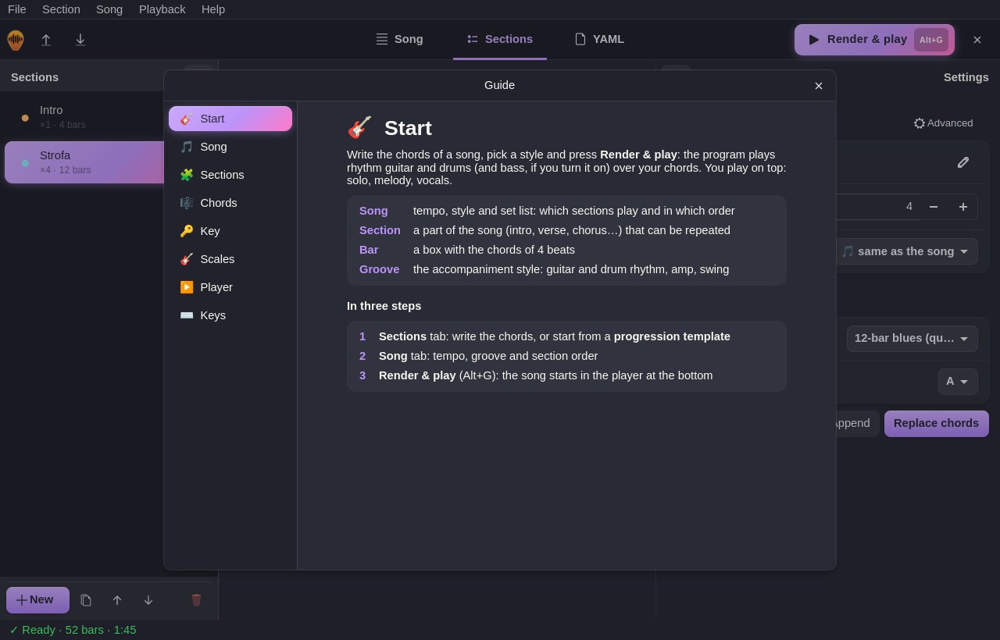

<p align="center">
  
</p>

<p align="center"><b>🇬🇧 English</b> · <a href="README.it.md">🇮🇹 Italiano</a></p>

<p align="center">
  <b>Write the chords, pick the groove, play along.</b><br>
  Backing tracks with rhythm guitar and drums <i>sampled from real instruments</i>, generated from a simple YAML file
  or from a graphical editor.
</p>

<p align="center">
  
  
  
  
  
  
  
</p>

---

## 📑 Contents

- [✨ Features](#-features)
- [📦 Installation](#-installation)
- [🚀 Quick start](#-quick-start)
- [🖥️ Graphical editor](#️-graphical-editor)
- [📖 Documentation](#-documentation)
- [🛠️ Development](#️-development)
- [🙏 Credits and licenses](#-credits-and-licenses)

---

## ✨ Features

- 🎸 **Real guitars**: Gretsch hollowbody (default), Epiphone, Fender solid body and an acoustic guitar, sampled note
  by note with several dynamics and round robins, plus real **staccato** hits for palm mutes and chops. Barre, open,
  jazz and triad voicings; down/up strums, boogie double stops, boom-chick. Every string plays one note at a time.
- 🔊 **Real amps and cabinets**: 5 sounds (clean, blues, twang, crunch, high gain) through real Marshall 4×12
  cabinets reproduced with their *impulse responses*; **double-tracked L/R** guitar in rock, **slapback** in rockabilly.
- 🥁 **Sampled acoustic drums** (Salamander Drumkit): open/closed hi-hat, ghost notes, variations every 4 bars,
  **fills** at the end of sections, crash on downbeats.
- 🎻 **Optional bass**: double bass or electric bass, with walking, root-fifth, eighths, reggae, tumbao…
- 🎚️ **153 grooves** in 9 styles (rock, blues, rockabilly, country, bluegrass, jazz, funk, reggae, soul), also different section
  by section; **repeatable sections** and set list (`[Intro, Verse x2, Chorus]`).
- 🧑‍🎤 **Sounds human**: micro-timing, varying dynamics, adjustable swing. **Automatic mix** with EQ, compression,
  convolution reverb and steady loudness.
- 🖥️ **Graphical editor** (GTK 4): bar grid with drag & drop, palette with the 12 notes, progression templates in
  every key, **player** with waveform, chord strip and **bar-to-bar loop**.
- 🎸 **Scales on the fretboard**: 14 scales and the B.B. King and Albert King blues boxes, **CAGED system**, **scales
  suggested** from the section's chords and **chord tones in real time** while the track plays.
- 🌐 **English and Italian**: interface, guide, messages and documentation; language picked from the Help menu (🇬🇧 / 🇮🇹).
- 📤 **Output**: WAV, MP3, **MIDI** for your DAW and separate **stems**. ⚡ 2 minutes of song in about 5 seconds.
- 📚 **90 example songs** with the progressions of blues, rock, rockabilly, country, bluegrass and jazz classics.

---

## 📦 Installation

**Linux / macOS**

```sh
curl -fsSL https://raw.githubusercontent.com/wdog/backingtrack/main/install.sh | bash
```

**Windows** (PowerShell)

```powershell
irm https://raw.githubusercontent.com/wdog/backingtrack/main/install.ps1 | iex
```

The script checks Python, installs ffmpeg if missing, installs `backingtrack`, adds an application menu entry on Linux
and downloads the samples (~300 MB, only once). Running it again = updating.
Manual install, updates, diagnostics and uninstalling: **[docs/en/installation.md](docs/en/installation.md)**.

---

## 🚀 Quick start

```sh
backingtrack examples/blues/sweet_home_chicago.yaml
```

```
♪ Sweet Home Chicago (progressione) | 125 BPM | 52 bars | 1:45
   Intro        x1  [blues]             | B7 | A7 | E7 | B7 |
   Strofa       x4  [blues]             | E7 | A7 | E7 | E7 | A7 | A7 | E7 | E7 | B7 | A7 | E7 | B7 |
   WAV   out/sweet_home_chicago.wav
   MIDI  out/sweet_home_chicago.mid   (4.8s)
```

The result is in `out/`. Open it with any player and play along. 🎶

A song is a YAML file of a few lines:

```yaml
title: My blues
tempo: 90
groove: blues
sections:
  - name: Verse
    repeat: 2
    chords: |
      | A7 | D7 | A7 | A7 |
      | D7 | D7 | A7 | A7 |
      | E7 | D7 | A7 | E7 |
```

Step by step: **[docs/en/tutorial.md](docs/en/tutorial.md)** · every key: **[docs/en/format.md](docs/en/format.md)**.

---

## 🖥️ Graphical editor

```sh
backingtrack gui [my_song.yaml]
```

<p align="center"></p>
<p align="center">
  
  
  
</p>

Three tabs: **Song** (tempo, groove, set list), **Sections** (chords, scales on the fretboard, progression templates)
and **YAML**. **Render & play** (`Alt+G`) creates the audio and plays it right away in the built-in player; `F1` opens
the guide; **Help ▸ Language / Lingua** switches between 🇬🇧 English and 🇮🇹 Italiano.
The whole editor, screen by screen: **[docs/en/gui.md](docs/en/gui.md)**.

---

## 📖 Documentation

| Page | Contents |
|---|---|
| [📦 Installation](docs/en/installation.md) | installer, manual install, samples, updating, diagnostics, uninstalling |
| [🖥️ Graphical editor](docs/en/gui.md) | tabs, chords and palette, scales and CAGED, player, shortcuts, language |
| [🎓 Tutorial and examples](docs/en/tutorial.md) | your first backing track step by step, complete song examples |
| [📝 Song format](docs/en/format.md) | YAML keys, how to read a bar, supported chords |
| [🥁 Grooves](docs/en/grooves.md) | the 153 grooves, style by style |
| [📚 Example songs](docs/en/songs.md) | the 90 included songs |
| [⌨️ Commands](docs/en/commands.md) | every command-line option |
| [❓ FAQ](docs/en/faq.md) | common problems |
| [⚙️ How it works](docs/en/development.md) | the audio pipeline, translations and the code structure |

Italian documentation: [README.it.md](README.it.md) and [docs/it/](docs/it/installazione.md).

---

## 🛠️ Development

```sh
git clone git@github.com:wdog/backingtrack.git && cd backingtrack
pipx install -e --system-site-packages .        # the command uses the repo files directly
python3 -m unittest discover tests               # tests (no samples needed)
python3 -m backingtrack render examples/*/*.yaml --dry-run   # validate every example
python3 docs/make_docs.py                        # regenerate groove/song tables and doc navigation
```

Pipeline: `song.py` (YAML → bars) → `arranger.py` (bars → notes on 6 strings) → `render.py` + `sfz.py` (notes →
samples) → `mixer.py` (amp, cabinets, mix with ffmpeg). Details in [docs/en/development.md](docs/en/development.md).

### 🥁 Creating a groove

A groove is an entry of the `GROOVES` dictionary in [`backingtrack/grooves.py`](backingtrack/grooves.py) and describes
**one 4/4 bar**: what the guitar does, what the drums do, the bass and the sound.

```python
"funk/disco": g("Disco funk: cassa in quattro, hi-hat aperto in levare",   # description (menus and --help)
                "clean",                                    # amp: clean blues twang crunch high
                pat("dudUdudUdudUdudU", 92, 70, dur=0.22),  # guitar: 16 characters = sixteenths
                DISCO_BEAT,                                 # drums: [(beat, GM note, velocity)]
                FUNK_TURN,                                  # variation every 4 bars
                bass="octave",                              # bass style
                double=True,                                # double-tracked guitar L/R
                voicing="triad"),                           # chord shape
```

**Guitar** — `pat("...")` writes the rhythm as text: 8 characters = eighths, 12 = triplets, 16 = sixteenths
(spaces are ignored). Uppercase = loud, lowercase = soft.

| Character | Hit | Character | Hit |
|---|---|---|---|
| `D` / `U` | down / up strum | `X` | chop (muted high strings) |
| `M` / `N` | muted down / up (palm mute) | `P` / `p` | power chord / muted power chord |
| `J` | 4-note jazz chord | `B` / `F` | root / fifth in the bass |
| `.` | rest | `-` | holds the previous note |

For boogie double stops there is `boogie("55665566")` (root + 5th/6th/7th). Otherwise write the event list:
`(beat, type, velocity[, length])`, with beats from 0 to 4 (`.5` = offbeat, moved by the swing; `T1`/`T2` = triplets).

**Drums** — a list of `(beat, note, velocity)` with the constants `KICK`, `SNARE`, `STICK`, `HH`, `OHH`, `PEDAL`, `LT`,
`MT`, `HT`, `CRASH`, `RIDE`, `BELL` and the helpers `hat8()`, `hat16()`, `hits(note, [beats])`. Use only notes present
in the Salamander kit (no cowbell or clap: there is `BELL`, the ride bell).

**Other parameters** of `g()`: `turn` (variation every 4 bars) and `fill` (end-of-section fill), `bass` (`eighths`
`rootfifth` `stop` `slow` `walk` `two` `octave` `funk` `reggae` `quarters` `dotted` `tumbao`), `swing` (0–1),
`double`, `slap` (slapback), `voicing` (`barre` `open` `jazz` `triad`), `mute_len` (length of muted hits).

Then: the name with the style prefix (`funk/…`) puts it in the right GUI menu; add the English description to
`GROOVES_EN` in `backingtrack/locale_en.py`; `python3 -m unittest discover tests` checks that every groove arranges
without errors and is translated; `python3 docs/make_docs.py` regenerates the groove tables in both languages.
A **new style** also needs `STYLE_EMOJI`/`STYLE_NAMES` in `gui.py` and the logo (`docs/make_images.py`).

### 🧰 Software and libraries used

backingtrack's code is under the **MIT** license (see [LICENSE](LICENSE)). It uses these programs and libraries, not
included in the repository:

| Software | Used for | License |
|---|---|---|
| [Python 3.8+](https://www.python.org) | the whole program | PSF License |
| [NumPy](https://numpy.org) | sampling engine, mix, reverb | BSD-3-Clause |
| [PyYAML](https://pyyaml.org) | reading and writing songs | MIT |
| [FFmpeg](https://ffmpeg.org) | amps and cabinets (convolution), EQ, compressors, limiter, MP3, FLAC, waveform | LGPL 2.1+ (GPL in some builds) |
| [GTK 4](https://www.gtk.org) | graphical interface | LGPL 2.1+ |
| [libadwaita](https://gnome.pages.gitlab.gnome.org/libadwaita/) | interface components | LGPL 2.1+ |
| [PyGObject](https://pygobject.gnome.org) | GTK from Python | LGPL 2.1+ |
| [Pillow](https://python-pillow.org) | only to generate logo and diagrams (`docs/make_images.py`) | MIT-CMU (HPND) |
| [SFZ](https://sfzformat.com) | open format for sampled instruments | open specification |

The **samples** are downloaded with `backingtrack setup` straight from their authors:

| Library | Instrument | Author | License |
|---|---|---|---|
| [Black & Green Guitars](https://github.com/sfzinstruments/karoryfer.black-and-green-guitars) | Gretsch guitar (default) | Karoryfer Samples | CC0 1.0 |
| [Emilyguitar](https://github.com/sfzinstruments/karoryfer.emilyguitar) | Epiphone guitar (optional) | Karoryfer Samples / D. Smolken | CC0 1.0 |
| [Electric Guitar FSBS](https://github.com/freepats/electric-guitar-FSBS-direct) | Fender guitar (optional) | FreePats | CC0 1.0 |
| [FSS Steel-String Guitar](https://freepats.zenvoid.org/Guitar/steel-acoustic-guitar.html) | acoustic guitar (optional) | FreePats / FlameStudios | GPL 3+ with an exception for songs |
| [Jester's Emerald](https://www.jester-dyne-productions.com/emerald-ir-pack/) and [Brutal IR](https://www.jester-dyne-productions.com/brutal-ir-pack/) | guitar cabinets (IR) | Jester Dyne Productions | free, commercial use allowed |
| [Salamander Drumkit](https://github.com/studiorack/salamander-drumkit) | drums | Alexander Holm | CC-BY-SA 3.0 |
| [Double bass (Rubner 1958)](https://github.com/sfzinstruments/dsmolken.double-bass) | double bass (optional) | D. Smolken | CC0 1.0 |
| [Sneakybass](https://github.com/sfzinstruments/karoryfer.sneakybass) | light double bass (optional) | D. Smolken | CC0 1.0 |
| [Black & Blue Basses](https://github.com/sfzinstruments/karoryfer.black-and-blue-basses) | electric bass (optional) | Karoryfer Samples | CC0 1.0 |

---

## 🙏 Credits and licenses

Code: **MIT**. If you publish songs made with the Salamander drums, credit the author: *"Drums: Salamander Drumkit by
Alexander Holm (CC-BY-SA 3.0)"*. The licenses of every component are in the table above.

The songs in `examples/` contain only chord progressions, which are not protected by copyright; the titles are there
only to recognize them.
