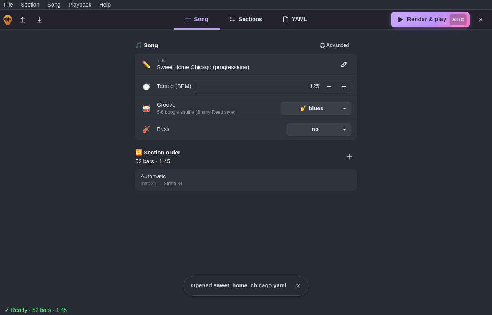

# Song

Title, tempo, groove, bass and the **section order** (with repeats and total length; empty list = order of the
Sections page). Among the advanced settings: guitar (Gretsch, Epiphone, Fender, acoustic) and amp, double tracking,
slapback, voicing, count-in, ending, drum fills, transpose, swing, humanize and output. Every choice has its own menu,
so an out-of-range value cannot be entered.

The **groove** is picked from a menu split by style (🤘 Rock, 🎷 Blues, 🕺 Rockabilly, 🤠 Country, 🎺 Jazz,
🪩 Funk, 🌴 Reggae, 🎤 Soul), with a short description of each item; the full one appears below the menu.

